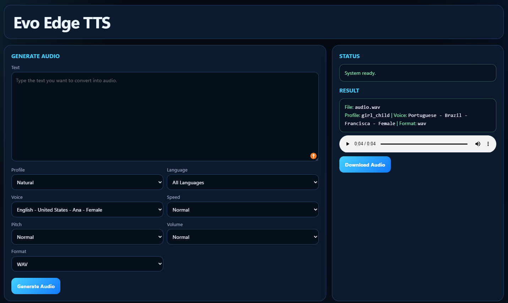

# Evo Edge TTS

Portable local Text-to-Speech with a clean browser interface powered by Microsoft Edge TTS.



## Overview

Evo Edge TTS is designed for users who want a simple Windows app experience without manually installing Python, configuring FFmpeg, or using a developer workflow.

The project runs a local FastAPI server and opens a browser-based interface where you can:

- type text and generate speech
- choose a voice profile
- adjust speed, pitch, and volume
- export audio as `MP3` or `WAV`
- download the generated file directly from the interface

## Main Features

- Portable setup with embeddable Python
- Automatic first-run installation
- Automatic FFmpeg download for WAV export
- Local browser UI
- Built-in API on `http://127.0.0.1:8890`
- Generated files saved in `output/`

## Supported Voice Languages

Evo Edge TTS is currently configured to expose voices from these language groups:

- English (`en-*`)
- Portuguese (`pt-*`)
- Spanish (`es-*`)
- French (`fr-*`)
- German (`de-*`)
- Japanese (`ja-*`)
- Norwegian (`no-*`)
- Swedish (`sv-*`)
- Danish (`da-*`)
- Dutch (`nl-*`)
- Arabic (`ar-*`)

Common examples included in the fallback list are:

- English (US)
- Portuguese (Brazil)
- Spanish (Spain)
- French (France)
- German (Germany)
- Japanese (Japan)
- Norwegian (Norway)
- Swedish (Sweden)
- Danish (Denmark)
- Dutch (Netherlands)
- Arabic

Important note:

- This project is a text-to-speech app, not a translator
- It can speak text in the supported voice languages above
- The exact list of available voices can vary depending on what `edge-tts` returns at runtime

## Requirements

- Windows
- Internet connection on the first run
- Permission to run `.bat` files and PowerShell scripts

Notes:

- Python is not installed globally on the machine
- FFmpeg is stored locally inside the project folder
- The app still needs internet access to generate voices because `edge-tts` connects to Microsoft Edge voice services

## Minimum Practical System Requirements

The project does not define a strict official hardware benchmark inside the codebase, but from the current implementation these are the practical minimum requirements:

- Windows 64-bit
- A default web browser
- Internet access for first-time setup
- Internet access during voice generation
- Permission to run local batch files and PowerShell scripts
- Enough free disk space for:
  - portable Python
  - Python packages
  - FFmpeg
  - generated audio files

Practical technical notes based on the code:

- The installer downloads `python-3.11.9-embed-amd64.zip`, so the portable environment is 64-bit
- FFmpeg is downloaded as a Windows 64-bit build
- No GPU is required
- No global Python installation is required
- No system-wide FFmpeg installation is required
- The app runs a local FastAPI server on port `8890`

If you want a safe real-world baseline for end users, the most reasonable expectation is:

- a normal modern Windows PC
- stable internet
- a browser such as Edge, Chrome, or Firefox

What is not formally documented by the code:

- exact minimum RAM
- exact minimum CPU generation
- exact minimum disk usage in MB after installation

Those values would need a measured installation test rather than a code-only review.

## Installation

There are two ways to install Evo Edge TTS.

### Option 1: Recommended for most users

1. Download the project as a ZIP from GitHub.
2. Extract the ZIP to a normal folder such as `Desktop` or `Documents`.
3. Double-click [`start.bat`](start.bat).
4. On the first run, the app will automatically:
   - download portable Python
   - download FFmpeg
   - install the required Python packages
   - start the local API
   - open the interface in your default browser

### Option 2: Manual pre-install

1. Download and extract the project.
2. Double-click [`Install.bat`](Install.bat).
3. Wait until the installation finishes.
4. Double-click [`start.bat`](start.bat).

## What Happens on First Run

When you start the app for the first time, Evo Edge TTS prepares its local environment inside the project folder.

It creates and uses:

- `env/` for embeddable Python
- `bin/` for `ffmpeg.exe`
- `output/` for generated audio files

No global Python setup is required.

## How to Use

1. Run [`start.bat`](start.bat).
2. Wait for the API window to finish loading.
3. Your browser will open the Evo Edge TTS interface automatically.
4. Type the text you want to convert.
5. Choose:
   - a profile
   - a voice
   - speed
   - pitch
   - volume
   - output format
6. Click `Generate Audio`.
7. Listen to the result in the built-in audio player.
8. Click `Download Audio` to save the file.

Generated files are also stored in the [`output`](output) folder.

## Installation Details

During setup, the project installs or prepares:

- Portable Python 3.11 embeddable
- `pip`
- Python dependencies from [`requirements.txt`](requirements.txt):
  - `edge-tts`
  - `fastapi`
  - `uvicorn`
  - `pydub`
  - `python-multipart`
- FFmpeg for WAV conversion

The installer stores these components locally inside the project folder instead of installing them system-wide.

## Startup and Shutdown

### Start

- Run [`start.bat`](start.bat)
- The launcher opens the app window
- The local API starts
- The browser opens only after the API is fully ready

### Stop

- Closing the running app window usually stops the local API
- If needed, you can force-stop the app with [`stop.bat`](stop.bat)

## File Structure

- [`app/api.py`](app/api.py): FastAPI backend and audio generation logic
- [`ui/index.html`](ui/index.html): Browser interface
- [`scripts/setup.ps1`](scripts/setup.ps1): Downloads Python, pip, dependencies, and FFmpeg
- [`scripts/start.bat`](scripts/start.bat): Starts the local API and opens the interface after the API is ready
- [`scripts/stop.bat`](scripts/stop.bat): Stops the API process on port `8890`
- [`Install.bat`](Install.bat): Optional manual installer
- [`start.bat`](start.bat): Main entry point for users
- [`stop.bat`](stop.bat): Optional forced shutdown shortcut

## API Endpoints

When the app is running, these endpoints are available:

- `GET /health`
- `GET /edge-tts/voices`
- `GET /edge-tts/profiles`
- `POST /edge-tts`
- Swagger docs: `http://127.0.0.1:8890/docs`

## Network and Runtime Behavior

- The app uses a local API at `127.0.0.1:8890`
- The browser UI talks to that local API
- Voice generation depends on online Edge TTS services
- MP3 is the native output path
- WAV is generated by converting the MP3 result locally through FFmpeg

## Audio Formats

- `MP3`: Native Edge TTS output and the fastest option
- `WAV`: Converted locally through FFmpeg after MP3 generation

## Troubleshooting

### The browser does not open

- Wait a few more seconds for the API to finish loading
- Check whether your browser blocked local file opening
- Open [`ui/index.html`](ui/index.html) manually if needed

### The app says the system is offline

- Keep the API window open
- Run [`start.bat`](start.bat) again
- Make sure port `8890` is not blocked by another process

### WAV does not work

- Make sure FFmpeg finished downloading during setup
- Run [`Install.bat`](Install.bat) again if the first setup was interrupted

### Voice generation fails

- Check your internet connection
- Edge TTS requires online access to Microsoft voice services

## Building a Portable Release ZIP

If you want to generate a new distributable ZIP:

1. Open PowerShell in the project folder.
2. Run:

```powershell
.\scripts\build_portable.ps1
```

3. The generated package will be placed in `dist/edge-tts-portable.zip`.

## Technologies Used

- Python Embeddable
- FastAPI
- Uvicorn
- edge-tts
- FFmpeg
- pydub
- HTML/CSS/JavaScript

## Legal Note

This project is not affiliated with or endorsed by Microsoft. Voice generation depends on Microsoft Edge TTS services.

